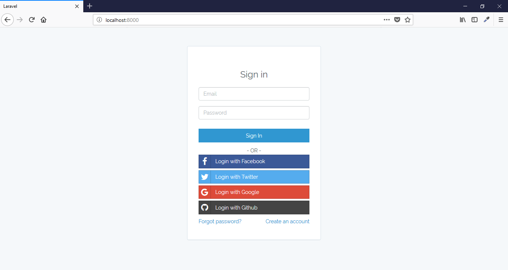
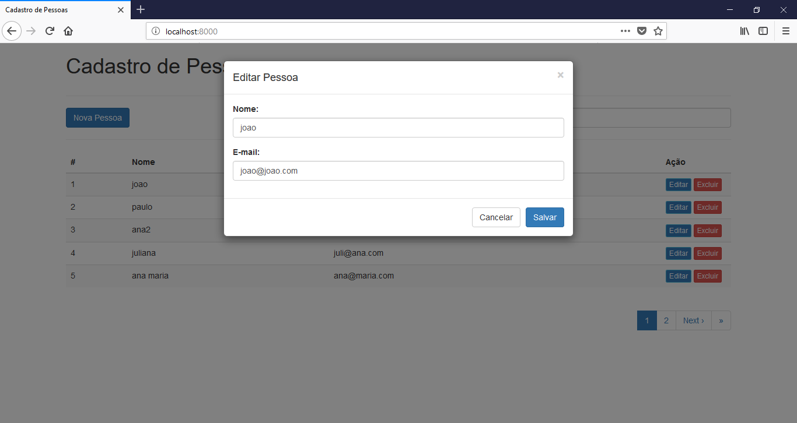
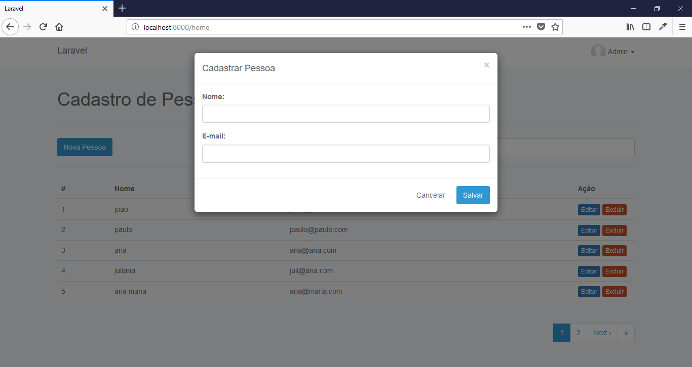
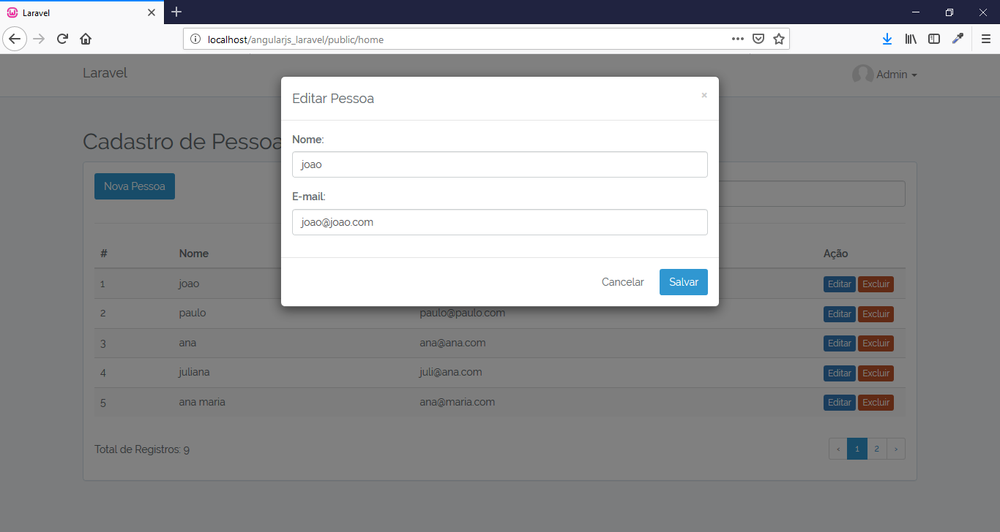
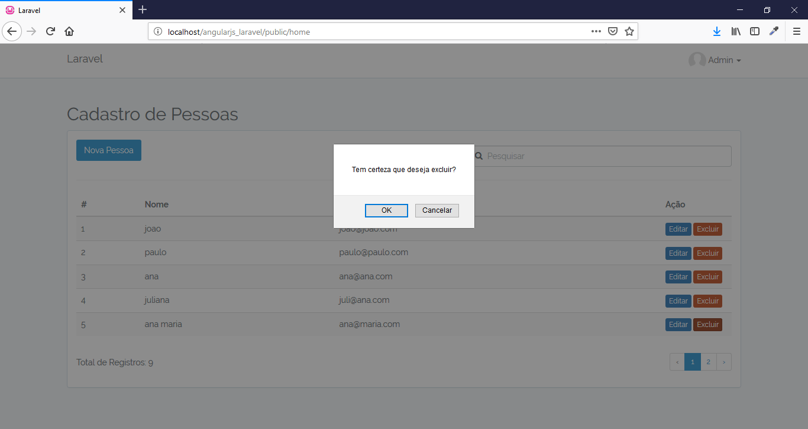

# Laravel AngularJS

Project of an CRUD developed with the Laravel Framework 5 and AngularJS 1.5.

## Features

- OAuth
- Login with E-mail, Google, Facebook, Twitter or GitHub
- Routes
- API CRUD
- Filter
- Pagination
- View Blade

## Requirements

- Apache
- PHP >= 5.5.9
- MySql >=5
- Composer

## Tecnologies

- PHP
- JS
- Jquery
- Json
- AngularJS
- CSS and SCSS
- Bootstrap
- Composer
- Artisan

## Installation

```
$ git clone https://github.com/danilomeneghel/angularjs_laravel.git

$ cd angularjs_laravel

$ composer install
```

Then create a database with name angularjs_laravel in your mysql.
Then run the following commands:

```
$ mysql -u <your user> -p <your password>

mysql> create database `angularjs_laravel`;
```

Back to terminal, check if the .env file has the correct data to connect to the database and run Artisan:

```
$ php artisan key:generate

$ php artisan migrate

$ php artisan db:seed
```

After everything is done, run the project:

```
$ php artisan serve
```

Finally open http://localhost:8000/ in your browser.

## Social Login

To set up login with social networks, follow the steps below:

```
FB_ID=app-id-here
FB_SECRET=app-secret-here

TW_ID=app-id-here
TW_SECRET=app-secret-here

GL_ID=app-id-here
GL_SECRET=app-secret-here

GH_ID=app-id-here
GH_SECRET=app-secret-here
```

Make sure you set correct redirect url in dev console of providers. It should be like `env('APP_URL') . '/oauth/twitter/callback'` format. 

## License

Laravel Admin is licensed under <a href="LICENSE">The MIT License (MIT)</a>.

## Screenshots

<br><br>
<br><br>
<br><br>
<br><br>
<br><br>
